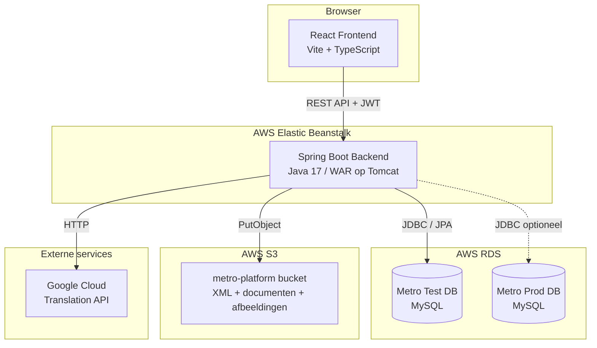
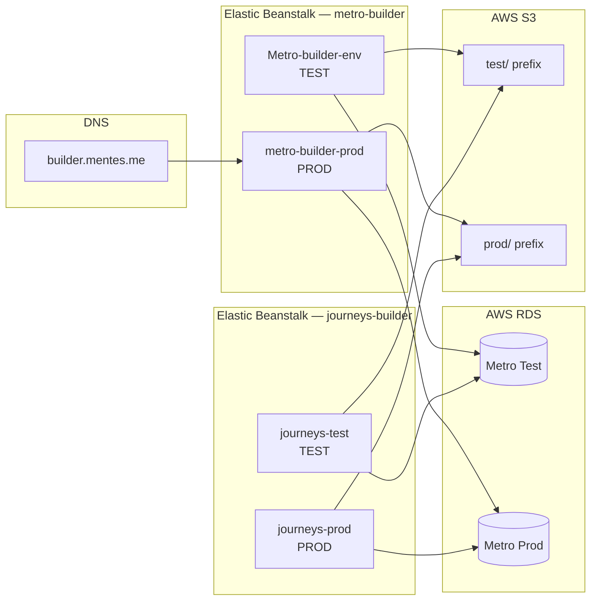
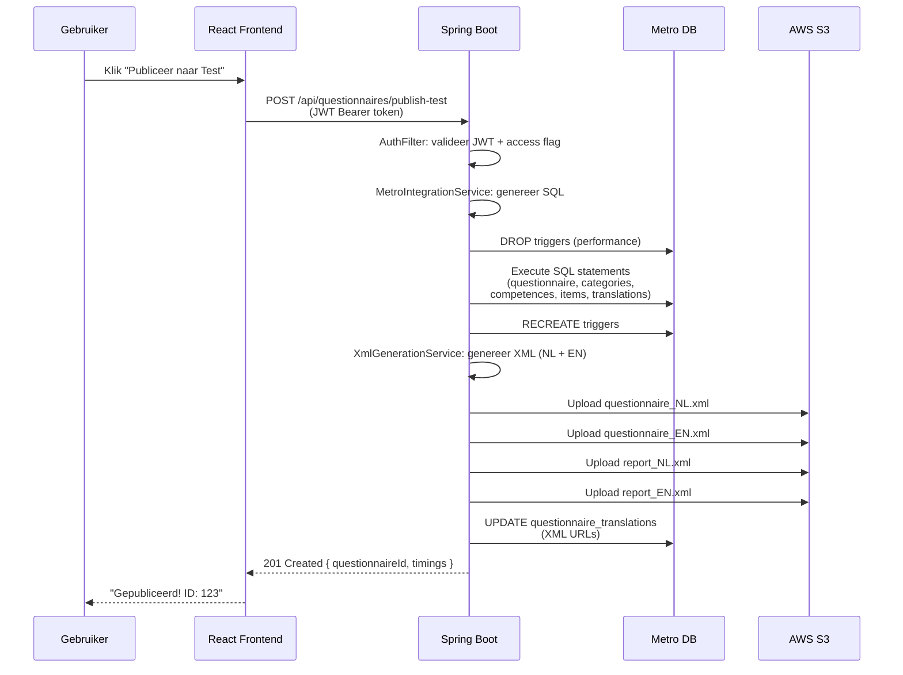

# Architectuuroverzicht

## Systeemoverzicht

Het platform bestaat uit één React frontend en één Spring Boot backend die beide builders (Assessment + Learning Journey) bedient. Na inloggen kiest de gebruiker een van de vier omgevingen. De backend schrijft naar de Metro MySQL database en uploadt XML/documenten naar S3.



## Deployment Architectuur

Eén backend deployment bedient alle vier omgevingen. De omgevingskeuze wordt bepaald door de ingelogde gebruiker (access flags) en de geselecteerde mode in de UI.



## Backend Package Structuur

```
com.mentesme.builder/
├── AssessmentBuilderApplication.java    # Entry point (SpringBootServletInitializer)
│
├── api/                                 # REST Controllers
│   ├── AuthController                   # Login, token generatie
│   ├── BuilderController                # Zoeken, vertalen, XML preview
│   ├── QuestionnairePublishController   # Assessment publiceren (test/prod)
│   ├── LearningJourneyPublishController # Learning Journey publiceren
│   ├── LearningJourneyController        # LJ ophalen (list/detail)
│   ├── AssessmentDefinitionController   # Assessment definities exporteren
│   ├── UserAdminController              # Gebruikersbeheer (ADMIN only)
│   ├── ProjectController                # Projecten CRUD
│   ├── DocumentUploadController         # Document upload naar S3
│   ├── ImageUploadController            # Afbeelding upload naar S3
│   └── HealthController                 # Health check, DB cleanup, perf test
│
├── service/                             # Business Logic
│   ├── TokenService                     # JWT generatie/validatie (HMAC-SHA256)
│   ├── UserService                      # Gebruikers CRUD, BCrypt, admin seeding
│   ├── QuestionnairePublishService      # Publish orchestratie (SQL → Metro → XML → S3)
│   ├── MetroIntegrationService          # SQL generatie voor assessments
│   ├── MetroLookupRepository            # Read-only Metro queries + trigger mgmt
│   ├── LearningJourneyPublishService    # LJ publish orchestratie
│   ├── LearningJourneyIntegrationService# LJ SQL generatie + insert
│   ├── LearningJourneyValidationService # LJ pre-publish validatie
│   ├── LearningJourneyLookupRepository  # LJ read-only queries
│   ├── XmlGenerationService             # Questionnaire + Report XML
│   ├── S3XmlUploadService              # S3 upload/delete met rollback
│   ├── GoogleTranslationService         # Google Cloud Translation
│   └── AiTranslationService             # OpenAI/Claude vertaling (fallback)
│
├── entity/                              # JPA Entities (builder_users tabel)
│   ├── BuilderUser                      # Gebruiker met rollen + access flags
│   ├── Item, ItemTranslation            # Assessment items
│   ├── CompetenceItem, QuestionnaireItem# Koppeltabellen
│   └── *Id (Embeddable composite keys)
│
├── model/                               # Request/Response DTOs
│   ├── AssessmentBuildRequest           # Assessment publish payload
│   ├── LearningJourneyPublishRequest    # LJ publish payload
│   ├── PublishResult, PublishEnvironment # Response types
│   └── ~45 andere DTOs
│
├── repository/                          # Spring Data JPA
│   └── BuilderUserRepository            # + Item/Translation/Competence repos
│
└── config/                              # Configuratie
    ├── AuthFilter                       # JWT servlet filter (fail-closed)
    ├── AuthProperties                   # builder.auth.* config binding
    ├── MetroDataSourceConfig            # Test Metro datasource + JPA + JDBC
    ├── MetroProdDataSourceConfig        # Prod Metro datasource (optioneel)
    ├── S3Config, S3Properties           # S3 client + properties
    └── WebConfig                        # SPA fallback routing
```

## Frontend Structuur

```
frontend/src/
├── main.tsx                    # Entry point: AuthWrapper → Login → EnvironmentSelector → Builder
├── Login.tsx                   # Login formulier
├── EnvironmentSelector.tsx     # 4 omgevingskaarten op basis van access flags
├── App.tsx                     # Assessment Builder (~3000 regels, monoliet)
├── auth.ts                     # Token/role/access flag management (localStorage)
├── api.ts                      # Alle API calls + authFetch wrapper
├── types.ts                    # TypeScript type definities
├── styles.css                  # Hoofd CSS (~2300 regels)
├── i18n/                       # Vertalingen (alleen NL)
│   ├── index.ts                # t() functie
│   └── nl.ts                   # Nederlandse strings
└── learning-journey/           # Learning Journey Builder
    ├── LearningJourneyBuilderPage.tsx  # Hoofd LJ component
    ├── JourneyHeader.tsx               # Metadata + groepen
    ├── StepList.tsx                    # Step lijst met drag-reorder
    ├── StepEditor.tsx                  # Step editor met content blocks
    ├── api.ts, types.ts, styles.css
    ├── preview/                        # Metro Preview replica
    │   ├── MetroPreviewPanel.tsx
    │   ├── MetroPreviewNav.tsx
    │   ├── MetroPreviewContent.tsx
    │   └── metroPreview.constants.ts
    └── components/editor/
        └── RichTextEditor.tsx          # TipTap WYSIWYG editor
```

## Request Flow

### Typische publish flow (Assessment)



## Belangrijke Architectuurbeslissingen

| Beslissing | Keuze | Reden |
|------------|-------|-------|
| Database schrijven | Raw SQL generatie | Metro schema is bestaand en complex; JPA mapping niet praktisch |
| Database lezen | Mix van JPA + raw SQL | JPA voor builder_users; raw SQL voor Metro lookups |
| Frontend state | Vanilla React (geen Redux/Zustand) | Eenvoud; state is per-pagina, niet cross-component |
| Routing | Conditional rendering (geen React Router) | Simpele flow: login → kies omgeving → builder |
| Auth | Custom JWT (geen Spring Security) | Lichtgewicht; volledige controle over token formaat |
| Packaging | WAR (niet JAR) | Deployment op Tomcat via Elastic Beanstalk |
| Omgevingen | Per-user access flags | Eén deployment bedient 4 omgevingen |
| Trigger bypass | DROP/RECREATE triggers | 20x performance verbetering bij bulk inserts |

## Bekende Technische Schuld

1. **App.tsx is ~3000 regels** — moet opgesplitst in componenten
2. **SQL injection risico** — MetroIntegrationService gebruikt string concatenation
3. **i18n onvolledig** — alleen Nederlandse UI-strings, geen EN vertaalbestand
4. **Geen frontend tests** — backend heeft 25 tests, frontend 0
5. **Token secret default** — `changeme-in-production` moet altijd overschreven worden
