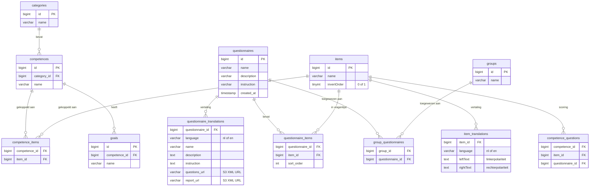
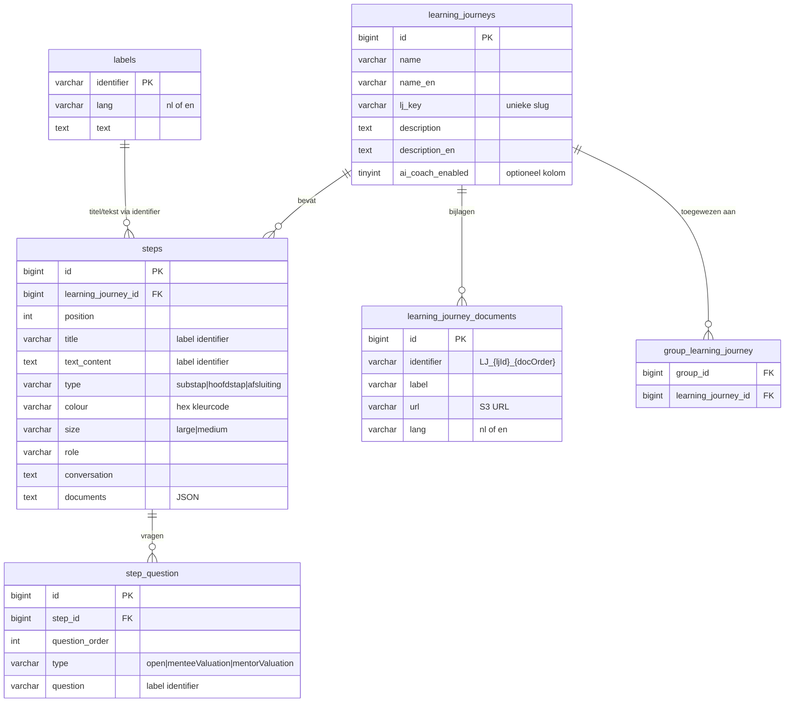
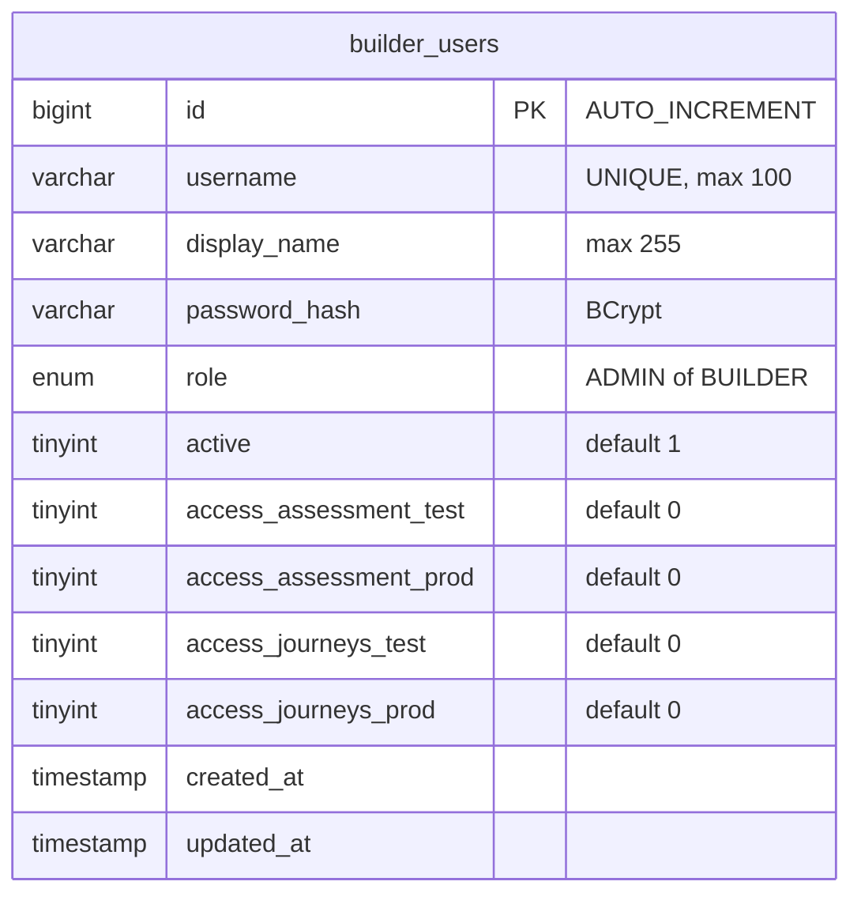

# Datamodel

## Overzicht

Er zijn twee database-contexten:

1. **Metro database** (AWS RDS MySQL) — de bron van waarheid voor assessments, learning journeys, competenties, categorieën. Wordt gelezen en geschreven door de builder, en gelezen door het Metro platform (afname, rapportage).
2. **Builder tabellen** (in dezelfde Metro DB) — applicatie-specifiek: gebruikers, projecten. Worden alleen door de builder gebruikt.

De builder schrijft naar Metro via **raw SQL** (geen JPA mappings voor Metro tabellen). Alleen `builder_users` en item-gerelateerde tabellen hebben JPA entities.

## Metro Database — Assessment Tabellen



### Toelichting Assessment tabellen

- **questionnaires**: Hoofdtabel. Elke assessment is een questionnaire.
- **questionnaire_translations**: NL en EN naam, beschrijving, instructie + S3 URLs naar de XML bestanden (questionnaire XML + report XML).
- **categories**: Competentiecategorieën (bijv. "Leiderschap", "Communicatie").
- **competences**: Competenties binnen een categorie (bijv. "Motiveren", "Delegeren").
- **goals**: Doelen per competentie (1-op-1 met competentie in huidige implementatie).
- **items**: Vraagitems met een 5-punts schaal (links/rechts polariteiten).
- **item_translations**: Meertalige tekst per item (leftText = linkerpool, rightText = rechterpool).
- **competence_items**: Koppeling item ↔ competentie.
- **questionnaire_items**: Koppeling item ↔ questionnaire met sorteervolgorde.
- **competence_questions**: Scoring-koppeling. **Let op triggers hieronder.**
- **group_questionnaires**: Welke groepen toegang hebben tot welke questionnaire.

### Trigger Optimalisatie (competence_questions)

De `competence_questions` tabel heeft 3 triggers die bij elke INSERT/UPDATE/DELETE de stored procedure `metro.calculate_user_competence_scores_for_all_assessments()` aanroepen. Deze procedure duurt ~10 seconden per aanroep.

**Probleem**: Bij het publiceren van een assessment worden tientallen rijen ge-INSERT. Zonder optimalisatie: 50 inserts × 10s = ~500s.

**Oplossing** (`MetroLookupRepository.executeSqlStatements()`):
1. `DROP TRIGGER IF EXISTS recalculate_user_competence_scores_on_insert_2`
2. `DROP TRIGGER IF EXISTS recalculate_user_competence_scores_on_update_2`
3. `DROP TRIGGER IF EXISTS recalculate_user_competence_scores_on_delete_2`
4. Alle SQL statements uitvoeren
5. Triggers recreëren (maar de stored procedure wordt **niet** aangeroepen na recreatie)

**Resultaat**: 52 statements in 313ms (was 21.5 seconden), 20× sneller.

**Bestand**: `backend/src/main/java/com/mentesme/builder/service/MetroLookupRepository.java`

## Metro Database — Learning Journey Tabellen



### Toelichting Learning Journey tabellen

- **learning_journeys**: Hoofdtabel met naam (NL+EN), beschrijving, unieke key, optioneel AI coach flag.
- **steps**: Stappen binnen een journey. Het `type` bepaalt de structuur:
  - `hoofdstap`: genummerde hoofdstap (large, blauw/oranje/paars)
  - `substap`: geneste substap (medium)
  - `afsluiting`: afsluitende stap (laatste)
- **step_question**: Vragen per stap (max 5 per substap). Het `question` veld verwijst naar een `labels.identifier`.
- **labels**: Meertalig label-systeem. Identifier koppelt een NL en EN tekst aan steps/vragen.
- **learning_journey_documents**: Bijlagen per journey (PDF, Word etc.), per taal.
- **group_learning_journey**: Groepstoewijzing.

### Structuurafleiding (colour/size → type)

De Metro database slaat step type af als `colour` + `size` combinatie. De builder leidt het structurele type af:

| colour | size | → structuralType |
|--------|------|-----------------|
| blauw/oranje/paars | large | hoofdstap |
| * | medium | substap |
| grijs | * | afsluiting |

**Bestand**: `backend/src/main/java/com/mentesme/builder/service/LearningJourneyLookupRepository.java`

## Builder Tabellen



### Toelichting

- **builder_users**: Authenticatie en autorisatie. Elke gebruiker heeft een rol (ADMIN/BUILDER) en 4 access flags die bepalen welke omgevingen zichtbaar/bruikbaar zijn.
- Tabel wordt automatisch aangemaakt bij opstarten (`UserService.ensureTableExists()`).
- Admin user wordt automatisch geseeded als er geen users bestaan (username: `support@mentes.me`, wachtwoord uit `BUILDER_AUTH_PASSWORD` env var).
- Migratie: nieuwe kolommen worden via `ALTER TABLE ADD COLUMN` toegevoegd als ze ontbreken.

**Bestand**: `backend/src/main/java/com/mentesme/builder/service/UserService.java`

## JPA vs Raw SQL

| Tabel(len) | Methode | Reden |
|------------|---------|-------|
| builder_users | JPA (BuilderUser entity) | Standaard CRUD, past goed bij JPA |
| items, item_translations, competence_items, questionnaire_items | JPA entities | Historisch; worden nu via raw SQL geschreven |
| questionnaires, categories, competences, goals, etc. | Raw SQL (JDBC) | Complex Metro schema; sequentie-generatie via `MAX(id)+1` |
| learning_journeys, steps, labels, etc. | Raw SQL (JDBC) | Bulk inserts met labels-systeem |
| Alle lookups (search, list) | Raw SQL (JDBC) | Complexe joins, performance |

### ID-generatie

Metro gebruikt geen AUTO_INCREMENT voor alle tabellen. De builder genereert IDs via:
```sql
SELECT MAX(id) FROM questionnaires  -- +1 voor nieuwe questionnaire
SELECT MAX(id) FROM categories      -- +1 voor nieuwe category
-- etc.
```
Dit wordt in één query opgehaald via `MetroLookupRepository.getAllMaxIds()`.

**Risico**: Bij gelijktijdige inserts kan een race condition optreden. In de praktijk is dit acceptabel omdat de builder single-user per assessment werkt.
