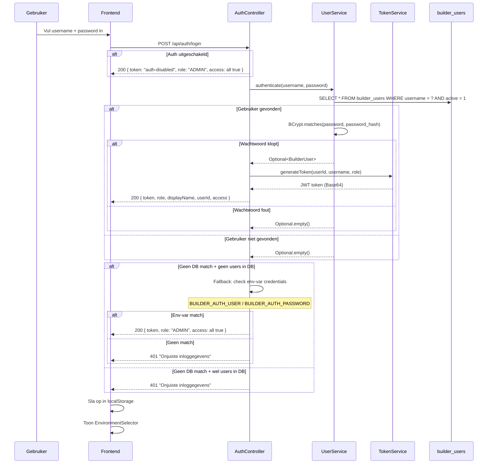
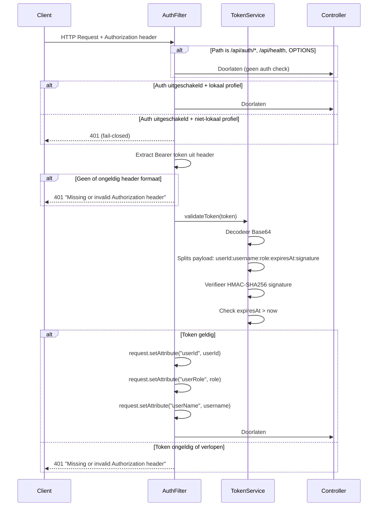

# Authenticatie & Autorisatie

## Overzicht

Het platform gebruikt een custom JWT-gebaseerde authenticatie (geen Spring Security). Elke gebruiker heeft een rol (ADMIN/BUILDER) en 4 access flags die bepalen welke omgevingen beschikbaar zijn.

## Login Flow



### Belangrijk: Legacy Fallback

De env-var login (`BUILDER_AUTH_USER` / `BUILDER_AUTH_PASSWORD`) werkt alleen als er **geen** users in de `builder_users` tabel staan. Zodra er minstens één user is aangemaakt (inclusief de automatisch geseede admin), wordt de env-var fallback uitgeschakeld. Dit voorkomt dat het oude "tester" account blijft werken naast de database-authenticatie.

**Bestand**: `backend/src/main/java/com/mentesme/builder/api/AuthController.java`

## Request Authenticatie (AuthFilter)



**Bestand**: `backend/src/main/java/com/mentesme/builder/config/AuthFilter.java`

## JWT Token Formaat

### Huidig formaat (met userId)

```
Base64({userId}:{username}:{role}:{expiresAt}:{signature})
```

Voorbeeld (gedecodeerd):
```
1:support@mentes.me:ADMIN:1772118530:hxY8bfVftR1fsFF0CxzlCW8anGxVzPSCUsiXf84OejM
```

### Legacy formaat (zonder userId)

```
Base64({username}:{role}:{expiresAt}:{signature})
```

Beide formaten worden ondersteund door `TokenService.validateToken()`.

### Token eigenschappen

| Eigenschap | Waarde |
|------------|--------|
| Algoritme | HMAC-SHA256 |
| Geldigheid | 24 uur |
| Secret | `BUILDER_AUTH_TOKEN_SECRET` env var |
| Default secret | `changeme-in-production` (MOET overschreven worden!) |
| Encoding | Base64 (niet Base64URL) |

**Bestand**: `backend/src/main/java/com/mentesme/builder/service/TokenService.java`

## Rollen

| Rol | Rechten |
|-----|---------|
| **ADMIN** | Alles: gebruikersbeheer, publiceren (mits access flag), instellingen |
| **BUILDER** | Assessments/journeys bouwen en publiceren (mits access flag) |

De rol bepaalt alleen of je het **admin panel** (gebruikersbeheer) kunt zien. De daadwerkelijke toegang tot omgevingen wordt bepaald door de **access flags**.

## Access Flags

Elke gebruiker heeft 4 onafhankelijke boolean flags:

| Flag | Geeft toegang tot | Checked door |
|------|-------------------|-------------|
| `accessAssessmentTest` | Assessment Builder → publiceer naar test Metro | `QuestionnairePublishController.requireAccess("assessmentTest")` |
| `accessAssessmentProd` | Assessment Builder → publiceer naar productie Metro | `QuestionnairePublishController.requireAccess("assessmentProd")` |
| `accessJourneysTest` | Learning Journey Builder → publiceer naar test Metro | `LearningJourneyPublishController.requireAccess("journeysTest")` |
| `accessJourneysProd` | Learning Journey Builder → publiceer naar productie Metro | `LearningJourneyPublishController.requireAccess("journeysProd")` |

### Hoe access flags werken

1. Bij **login**: de backend stuurt de access flags mee in de response
2. De **frontend** slaat ze op in localStorage en toont alleen omgevingen waar je toegang tot hebt in de `EnvironmentSelector`
3. Bij **publiceren**: de backend haalt de user opnieuw op uit de database en controleert de flag. Dit is een **server-side** check — de frontend filter is alleen UX.

### Access check implementatie

```java
private void requireAccess(HttpServletRequest httpRequest, String flag) {
    String userIdStr = (String) httpRequest.getAttribute("userId");
    long userId = Long.parseLong(userIdStr);
    BuilderUser user = userService.findById(userId).orElseThrow(...);
    boolean allowed = switch (flag) {
        case "assessmentTest" -> user.isAccessAssessmentTest();
        case "assessmentProd" -> user.isAccessAssessmentProd();
        case "journeysTest"   -> user.isAccessJourneysTest();
        case "journeysProd"   -> user.isAccessJourneysProd();
        default -> false;
    };
    if (!allowed) throw new ResponseStatusException(HttpStatus.FORBIDDEN);
}
```

## Frontend Auth Management

### localStorage Keys

| Key | Waarde |
|-----|--------|
| `builder-auth-token` | JWT token string |
| `builder-auth-role` | `"ADMIN"` of `"BUILDER"` |
| `builder-auth-display-name` | Weergavenaam |
| `builder-auth-user-id` | Numeriek user ID |
| `builder-auth-access` | JSON: `{"assessmentTest":true,...}` |

### authFetch Wrapper

Alle API calls gaan via `authFetch()` in `frontend/src/api.ts`:

```typescript
export async function authFetch(url, options): Promise<Response> {
    // Voegt Authorization: Bearer <token> header toe
    // Bij 401 response: clearToken() + window.location.reload()
}
```

Auto-logout: als de backend een 401 teruggeeft (token verlopen, ongeldig), wordt de gebruiker automatisch uitgelogd en teruggestuurd naar het loginscherm.

**Bestanden**: `frontend/src/auth.ts`, `frontend/src/api.ts`

## Wachtwoord Opslag

- Algoritme: **BCrypt** (via `spring-security-crypto`)
- Default strength: 10 rounds
- Opgeslagen als `password_hash` in `builder_users`
- Wachtwoord wijzigen: `PUT /api/admin/users/{id}/password` (alleen ADMIN)
- Geen self-service wachtwoord wijzigen (moet door admin)

## Admin User Seeding

Bij eerste opstart (als `builder_users` leeg is) wordt automatisch een admin aangemaakt:

| Eigenschap | Waarde |
|------------|--------|
| Username | `support@mentes.me` |
| Display name | `MentesMe Support` |
| Wachtwoord | uit `BUILDER_AUTH_PASSWORD` env var |
| Rol | ADMIN |
| Alle access flags | true |

Als `BUILDER_AUTH_PASSWORD` niet gezet is, wordt er **geen** admin geseeded (warning in logs).

**Bestand**: `backend/src/main/java/com/mentesme/builder/service/UserService.java`

## Huidige Gebruikers (productie)

| ID | Username | Rol | Omgevingen |
|----|----------|-----|-----------|
| 1 | support@mentes.me | ADMIN | Alle 4 |
| 2 | pepijn@mentes.me | BUILDER | Alle 4 |
