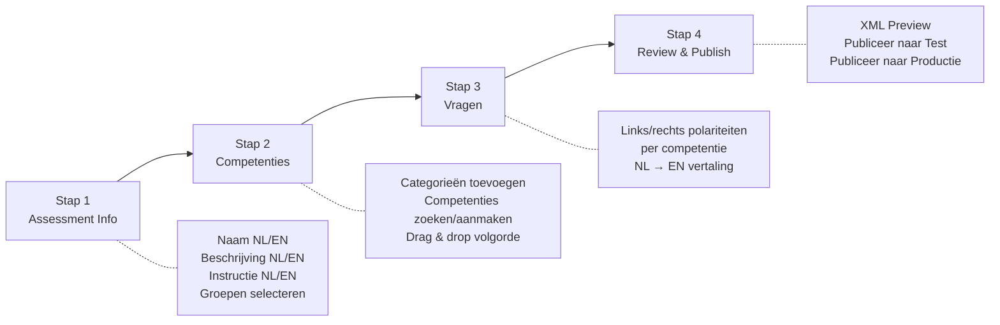
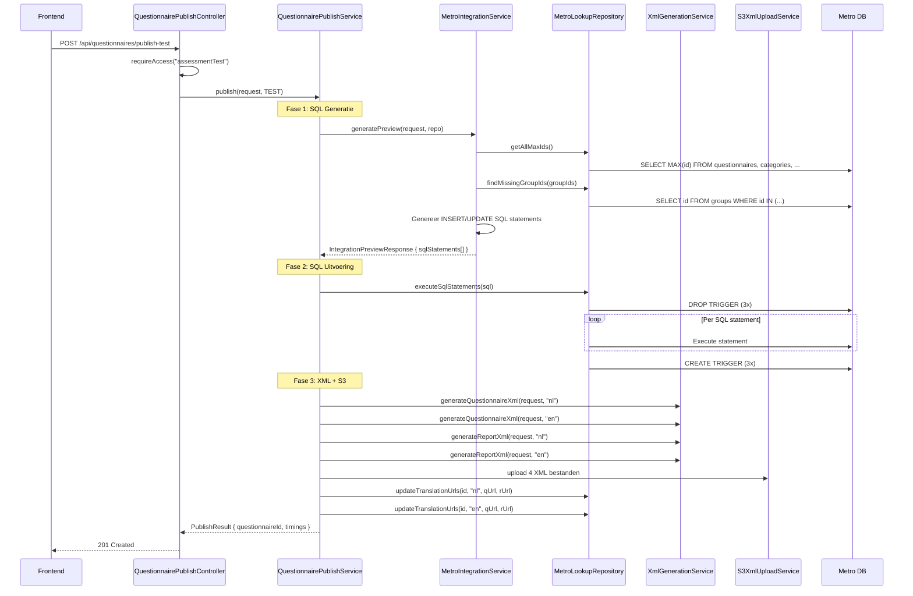

# Assessment Builder

## Overzicht

De Assessment Builder is een 4-stappen wizard waarmee competentie-assessments gebouwd en gepubliceerd worden naar de Metro database. Elke assessment bestaat uit categorieën, competenties en vragen (5-punts Likert-schaal met links/rechts polariteiten). Alle content wordt tweetalig opgeslagen (NL + EN).

## Wizard Flow



## Stap 1: Assessment Informatie

Basisgegevens van de assessment:

- **Naam** (NL + EN): uniek; wordt gecheckt tegen bestaande questionnaires (`GET /api/questionnaires/check?name=`)
- **Beschrijving** (NL + EN): verschijnt in het rapport als introductietekst
- **Instructie** (NL + EN): verschijnt bovenaan de vragenlijst
- **Groepen**: multi-select met zoekfunctie (`GET /api/groups/search?q=`)

### Duplicate Check

Bij het invullen van de naam wordt een debounced check gedaan:
- Als de naam al bestaat: tonen van de bestaande questionnaire ID
- Optie om de bestaande questionnaire te **bewerken** (edit mode) of een nieuwe aan te maken

## Stap 2: Competentie-matrix

Hier wordt de structuur van de assessment opgebouwd. Elke rij is een competentie binnen een categorie:

```
Categorie: Leiderschap
├── Competentie: Motiveren
├── Competentie: Delegeren
└── Competentie: Coachen

Categorie: Communicatie
├── Competentie: Luisteren
└── Competentie: Presenteren
```

### Autocomplete zoeken

- **Categorieën**: `GET /api/categories/search?q=` — zoekt in Metro, toont NL + EN naam
- **Competenties**: `GET /api/competences/search?q=` — idem
- Bij een bestaande categorie/competentie wordt het `existingId` ingevuld
- Bij een nieuwe: `isNew = true`, de builder maakt deze aan bij publicatie

### Drag & Drop

Competenties kunnen versleept worden binnen en tussen categorieën om de volgorde te wijzigen. Dit bepaalt de `sort_order` in `questionnaire_items`.

## Stap 3: Vragen

Per competentie worden de vraag-polariteiten ingevuld:

| Veld | Voorbeeld |
|------|-----------|
| Links (NL) | "Kan anderen niet motiveren" |
| Links (EN) | "Cannot motivate others" |
| Rechts (NL) | "Motiveert anderen uitstekend" |
| Rechts (EN) | "Excels at motivating others" |

### Vertaling

De "Vertaal NL → EN" knop verstuurt alle Nederlandse teksten in één batch naar `POST /api/translate`. Vertalingen worden via Google Cloud Translation gedaan. Als Google niet geconfigureerd is, wordt AI-vertaling (OpenAI/Claude) als fallback gebruikt.

Vertaalstatus per veld wordt bijgehouden via `translatingFields: Set<string>` — de UI toont een spinner per veld dat vertaald wordt.

## Stap 4: Review & Publish

### XML Preview

Vier tabs tonen de gegenereerde XML:
1. **Questionnaire NL** — de vragenlijst in het Nederlands
2. **Questionnaire EN** — de vragenlijst in het Engels
3. **Report NL** — het rapport template in het Nederlands
4. **Report EN** — het rapport template in het Engels

De XML wordt gegenereerd via `POST /api/assessments/xml-preview` (zonder te publiceren).

### Publiceren

- **Publiceer naar Test**: `POST /api/questionnaires/publish-test` — schrijft naar test Metro DB
- **Publiceer naar Productie**: `POST /api/questionnaires/publish-production` — schrijft naar productie Metro DB, met bevestigingsmodal

Na publicatie toont de UI:
- Het questionnaire ID
- Timing diagnostiek (SQL generatie, uitvoering, XML upload)

## Publish Flow (Backend)



### SQL Generatie Details

`MetroIntegrationService.generatePreview()` genereert de volgende SQL in volgorde:

1. **Questionnaire**: `INSERT INTO questionnaires` (of `UPDATE` bij edit mode)
2. **Questionnaire translations**: `INSERT INTO questionnaire_translations` (NL + EN)
3. Per competentie:
   - **Category**: `INSERT INTO categories` (als nieuw) of hergebruik bestaand ID
   - **Competence**: `INSERT INTO competences` (als nieuw) of hergebruik
   - **Goal**: `INSERT INTO goals` (1 per competentie)
   - **Item**: `INSERT INTO items` + `INSERT INTO item_translations` (NL + EN)
   - **Koppelingen**: `INSERT INTO competence_items`, `INSERT INTO questionnaire_items`, `INSERT INTO competence_questions`
4. **Groepen**: `INSERT IGNORE INTO group_questionnaires` per groep

**Let op**: De SQL wordt gegenereerd via string concatenation (`"INSERT INTO items (id, name) VALUES (" + id + ", '" + name + "')"`) — dit is een **SQL injection risico**. Zie [Architectuuroverzicht](01-architecture-overview.md#bekende-technische-schuld).

**Bestand**: `backend/src/main/java/com/mentesme/builder/service/MetroIntegrationService.java`

### XML Formaat

De gegenereerde XML volgt het Metro questionnaire formaat:

```xml
<?xml version="1.0" encoding="UTF-8"?>
<questionnaire name="Persoonlijk Leiderschap" language="NL">
  <section title="Leiderschap" instruction="...">
    <rangeQuestion id="1.1"
                   left="Kan anderen niet motiveren"
                   right="Motiveert anderen uitstekend" />
    <rangeQuestion id="1.2"
                   left="Delegeert niet"
                   right="Delegeert effectief" />
  </section>
</questionnaire>
```

De XML wordt ge-upload naar S3 met het pad:
```
{prefix}/{lang}/{type}_{slug}_{LANG}.xml
```
Voorbeeld: `test/nl/questionnaire_persoonlijk_leiderschap_NL.xml`

**Bestand**: `backend/src/main/java/com/mentesme/builder/service/XmlGenerationService.java`

## Edit Mode

Een bestaande assessment kan geladen en bewerkt worden:

1. **Via Open dialog → Database tab**: zoek op naam, selecteer een questionnaire
2. `GET /api/assessment-definitions/{id}` haalt de volledige definitie op
3. `mapDefinitionToForm()` converteert de database-structuur naar de wizard form state
4. Bij publicatie: als `editQuestionnaireId` gezet is, worden bestaande items verwijderd en opnieuw aangemaakt (volledige replace)

**Bestanden**: `frontend/src/mapDefinitionToForm.ts`, `backend/src/main/java/com/mentesme/builder/service/AssessmentDefinitionRepository.java`

## Compose Mode

Meerdere bestaande assessments kunnen gecombineerd worden tot één nieuwe:

1. **Via Open dialog → Compose tab**: selecteer meerdere questionnaires
2. `POST /api/assessment-definitions/compose` met de geselecteerde IDs
3. De backend voegt alle competenties + vragen samen
4. Het resultaat wordt geladen in de wizard als een nieuwe assessment

## Project Opslag

Assessments kunnen als project worden opgeslagen (werk-in-uitvoering):

- **Server-backed**: `PUT /api/projects/{id}` slaat de volledige wizard state op
- **Fallback**: localStorage als de server niet beschikbaar is
- **Auto-save**: bij stap-wisseling wordt het project automatisch opgeslagen
- **Open dialog → Projects tab**: lijst van opgeslagen projecten

De project data bevat de complete form state: assessment metadata, competenties, vragen, groepen, wizard stap.

**Bestand**: `frontend/src/App.tsx` (projectbeheer sectie), `backend/src/main/java/com/mentesme/builder/api/ProjectController.java`

## Frontend Componenten

De Assessment Builder leeft momenteel in één groot bestand:

| Component/Sectie | Bestand | Regels |
|-------------------|---------|--------|
| Assessment Builder (alles) | `frontend/src/App.tsx` | ~3000 |
| Type definities | `frontend/src/types.ts` | 185 |
| API calls | `frontend/src/api.ts` | 345 |
| Styling | `frontend/src/styles.css` | 2288 |
| DB → Form mapping | `frontend/src/mapDefinitionToForm.ts` | 67 |

**Geplande refactoring**: App.tsx opsplitsen in ~15 componenten (WizardNav, AssessmentForm, CompetenceMatrix, QuestionEditor, ReviewPublish, etc.). Zie `docs/restyling-status.md` in het memory bestand voor het volledige plan.

## Mockup

Er is een interactieve HTML mockup voor de redesign van de Assessment Builder:
- **Bestand**: `.claude/mockup-restyling.html`
- **Analyse**: `.claude/analyse-restyling-frontend.md`
- **Status**: Mockup goedgekeurd, implementatie nog niet gestart
- Voorwaarde: huidige versie moet eerst stabiel werken
