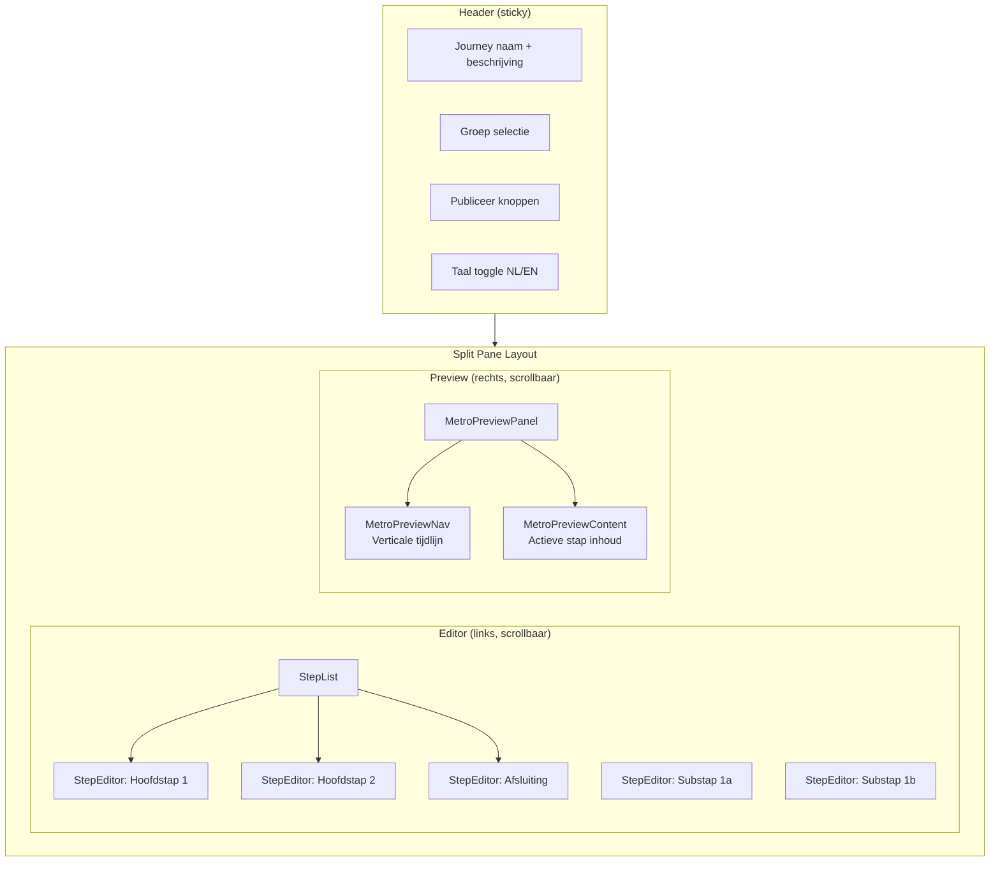
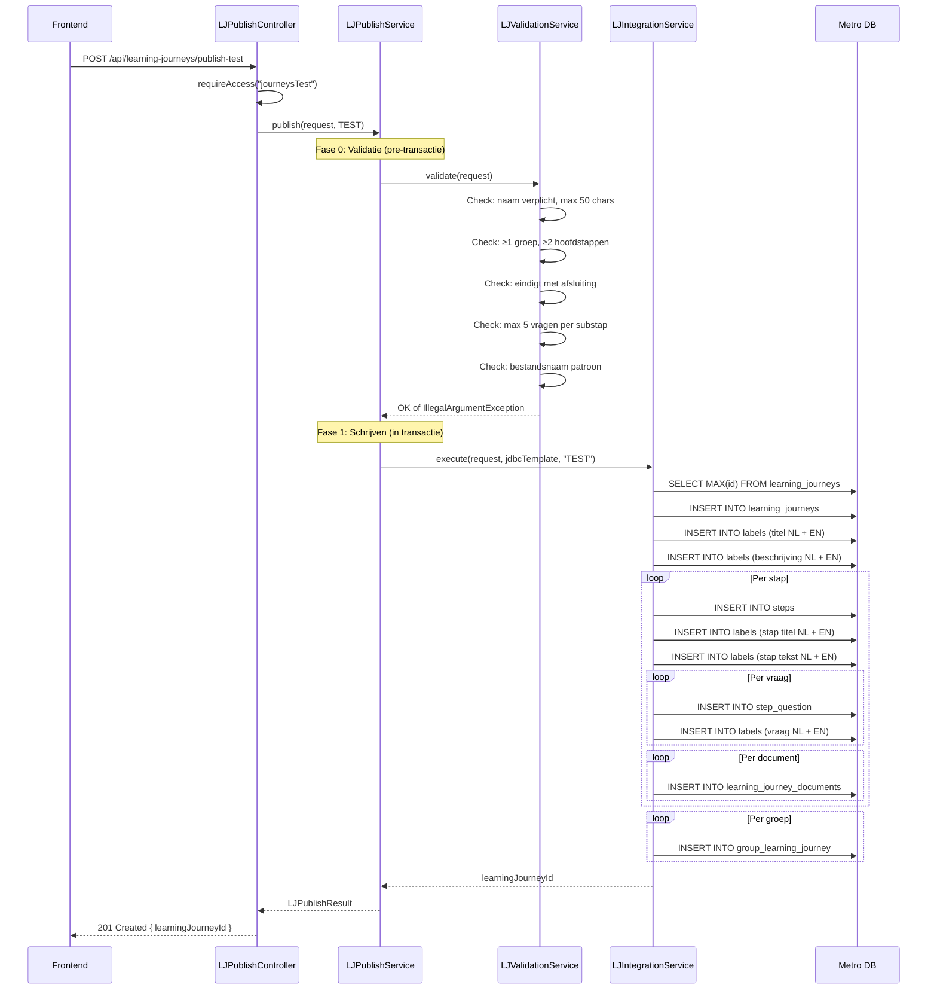

# Learning Journey Builder

## Overzicht

De Learning Journey Builder is een split-pane editor voor het ontwerpen van interactieve leerpaden. Links de editor met stappen en content blocks, rechts een live preview die de Metro Learning Route nabootst. Journeys worden gepubliceerd naar dezelfde Metro database en afgenomen via het Metro platform.

## UI Structuur



## Step Types

Elke journey bestaat uit een geordende reeks stappen met drie types:

| Type | Beschrijving | Visueel in preview |
|------|-------------|-------------------|
| `hoofdstap` | Genummerde hoofdsectie | Groot gevuld cirkel (16px), bold label |
| `substap` | Geneste stap onder een hoofdstap | Klein cirkel (12px), lichter label |
| `afsluiting` | Afsluitende stap (altijd laatste) | Groot open cirkel (18px) |

### Minimale structuur

Een geldige journey moet bevatten:
- Minimaal **2 hoofdstappen**
- Precies **1 afsluiting** (als laatste stap)
- Minimaal **1 groep** toegewezen

## Step Editor

Elke stap heeft de volgende bewerkbare velden:

### Basisvelden (tweetalig)
- **Titel** (NL + EN): verschijnt in de navigatie en als heading
- **Tekst** (NL + EN): hoofdinhoud van de stap

### Content Blocks

Stappen kunnen meerdere content blocks bevatten, versleepbaar in volgorde:

| Block type | Beschrijving | Editor |
|-----------|-------------|--------|
| `text` | Rich text met opmaak | TipTap WYSIWYG (Bold, Italic, H2, H3, Lists) |
| `image` | Afbeelding | URL + alt tekst |
| `video` | Video embed | YouTube/Vimeo URL (auto-embed) |

### Vragen (max 5 per substap)

Per stap kunnen vragen worden toegevoegd:

| Vraagtype | Gebruik |
|-----------|---------|
| `open` | Vrije tekstvraag |
| `menteeValuation` | Zelfevaluatie schaal (voor afsluiting) |
| `mentorValuation` | Mentor-evaluatie schaal (voor afsluiting) |

### Documenten

Bijlagen per stap:
- Label + bestandsupload naar S3
- Per taal (NL/EN)
- Bestandsnaam validatie: `^[a-zA-Z0-9][a-zA-Z0-9._-]*$`

### Opties per stap
- **chatboxEnabled**: chat/reflectie functie aan/uit
- **uploadEnabled**: document upload door deelnemer aan/uit

## Metro Preview Panel

De rechter helft toont een nauwkeurige replica van hoe de journey eruitziet in het Metro platform.

### Layout specificaties

```
┌─────────────────────────────────────────────────────────┐
│  Journey Titel (22px bold #222)                         │
├──────────────────────┬──────────────────────────────────┤
│  Nav kolom (200px)   │  Content kolom (vanaf 240px)     │
│                      │                                  │
│  ● Hoofdstap 1 ──── │  HOOFDSTAP 1                     │
│  │                   │  Welkom bij de journey            │
│  ○  Substap 1a      │                                  │
│  │                   │  [Inhoud van actieve stap]        │
│  ○  Substap 1b      │                                  │
│  │                   │  Vragen:                          │
│  ● Hoofdstap 2      │  1. Wat vind je interessant?      │
│  │                   │                                  │
│  ◯ Afsluiting       │  [Ontdek meer] knop              │
│                      │                                  │
└──────────────────────┴──────────────────────────────────┘
```

### Kleuren

| Element | Kleur | Hex |
|---------|-------|-----|
| Eerste hoofdstap groep | Blauw | `#58B5E3` |
| Tweede hoofdstap groep | Amber/Oranje | `#F2A83A` / `#F2994A` |
| Derde hoofdstap groep | Paars | `#9B51E0` |
| Inactieve substap | Grijs | `#C0C0C0` |
| Verticale lijn | Lichtgrijs | `#D8D8D8` |
| Actieve substap tekst | Amber | `#E8A230` |

### Cirkel afmetingen

| Element | Diameter | Stijl |
|---------|----------|-------|
| Hoofdstap | 16px | Gevuld (kleur van groep) |
| Actieve substap | 12px | Gevuld (kleur van groep) |
| Inactieve substap | 10px | Outline 2px `#C0C0C0` |
| Afsluiting | 18px | Outline 2px `#C0C0C0` |

### Verticale Ritme (center-to-center afstanden)

| Van → Naar | Afstand |
|------------|---------|
| Hoofdstap → Hoofdstap | 48px |
| Hoofdstap → Eerste substap | 32px |
| Substap → Substap | 28px |
| Laatste substap → Volgende hoofdstap | 44px |

### Typografie

| Element | Grootte | Gewicht | Kleur |
|---------|---------|---------|-------|
| Journey titel | 22px | Bold | `#222` |
| Nav hoofdstap label | 13px | Semi-bold | `#444` |
| Nav substap label | 12px | Normal | `#999` (actief: `#E8A230`) |
| Content stap titel | 15px | Bold, uppercase | `#E8A230` |
| Body tekst | 13px | Normal | `#444` |
| "Ontdek meer" knop | 11px | Normal | Border 1px solid `#CCC` |

**Bestanden**: `frontend/src/learning-journey/preview/metroPreview.constants.ts`, `MetroPreviewNav.tsx`, `MetroPreviewContent.tsx`

## Publish Flow



### Meertaligheid via Labels

In tegenstelling tot assessments (die aparte *_translations tabellen gebruiken), werkt de Learning Journey met een **labels** tabel:

```
labels:
  identifier: "LJ_45_STEP_1_TITLE"
  lang: "nl"
  text: "Welkom"

  identifier: "LJ_45_STEP_1_TITLE"
  lang: "en"
  text: "Welcome"
```

Het `steps.title` veld bevat de label identifier (bijv. `LJ_45_STEP_1_TITLE`), niet de daadwerkelijke tekst. Het Metro platform resolved deze via een JOIN op de `labels` tabel.

### Structuurafleiding bij laden

Bij het laden van een bestaande journey moet het structurele type afgeleid worden uit de `colour` en `size` velden:

```java
// LearningJourneyLookupRepository.findSteps()
String structuralType = switch (size) {
    case "large" -> "hoofdstap";
    case "medium" -> "substap";
    default -> colour.equals("#C0C0C0") ? "afsluiting" : "substap";
};
```

**Bestand**: `backend/src/main/java/com/mentesme/builder/service/LearningJourneyLookupRepository.java`

## Frontend Componenten

| Component | Bestand | Doel |
|-----------|---------|------|
| LearningJourneyBuilderPage | `frontend/src/learning-journey/LearningJourneyBuilderPage.tsx` | Hoofdcomponent, state management |
| JourneyHeader | `frontend/src/learning-journey/JourneyHeader.tsx` | Naam, beschrijving, groepen, publish knoppen |
| StepList | `frontend/src/learning-journey/StepList.tsx` | Stappenlijst met drag-reorder |
| StepEditor | `frontend/src/learning-journey/StepEditor.tsx` | Individuele stap bewerken |
| RichTextEditor | `frontend/src/learning-journey/components/editor/RichTextEditor.tsx` | TipTap WYSIWYG |
| MetroPreviewPanel | `frontend/src/learning-journey/preview/MetroPreviewPanel.tsx` | Preview container |
| MetroPreviewNav | `frontend/src/learning-journey/preview/MetroPreviewNav.tsx` | Verticale tijdlijn navigatie |
| MetroPreviewContent | `frontend/src/learning-journey/preview/MetroPreviewContent.tsx` | Inhoud actieve stap |

### State Structuur

```typescript
interface LearningJourneyDraft {
  name: BilingualText;        // { nl: string, en: string }
  description: BilingualText;
  groupIds: number[];
  aiCoachEnabled: boolean;
  steps: StepDraft[];
}

interface StepDraft {
  key: string;                // UUID
  structuralType: "hoofdstap" | "substap" | "afsluiting";
  title: BilingualText;
  textContent: BilingualText;
  blocks: ContentBlock[];
  questions: QuestionDraft[];
  documents: DocumentDraft[];
  chatboxEnabled: boolean;
  uploadEnabled: boolean;
}
```

**Bestanden**: `frontend/src/learning-journey/types.ts`, `frontend/src/learning-journey/api.ts`

## Mockup

De goedgekeurde mockup is een self-contained HTML bestand:
- **Bestand**: `mockup-learning-journey-builder.html` (project root)
- Gebruikt: React 18 CDN + Tailwind CDN + Babel standalone
- Split-pane: 55% editor / 45% preview
- Editor: warm Scandinavisch design (sand/sage/steel/iris palette)
- Preview: exacte Metro Learning Route replica

## Validatieregels Samenvatting

| Regel | Waarde |
|-------|--------|
| Naam verplicht | Ja, max 50 tekens |
| Groepen | Minimaal 1 |
| Hoofdstappen | Minimaal 2 |
| Afsluiting | Verplicht als laatste stap |
| Vragen per substap | Max 5 |
| Bestandsnaam | `^[a-zA-Z0-9][a-zA-Z0-9._-]*$` |
| Talen | Alleen `nl` en `en` |

**Bestand**: `backend/src/main/java/com/mentesme/builder/service/LearningJourneyValidationService.java`
