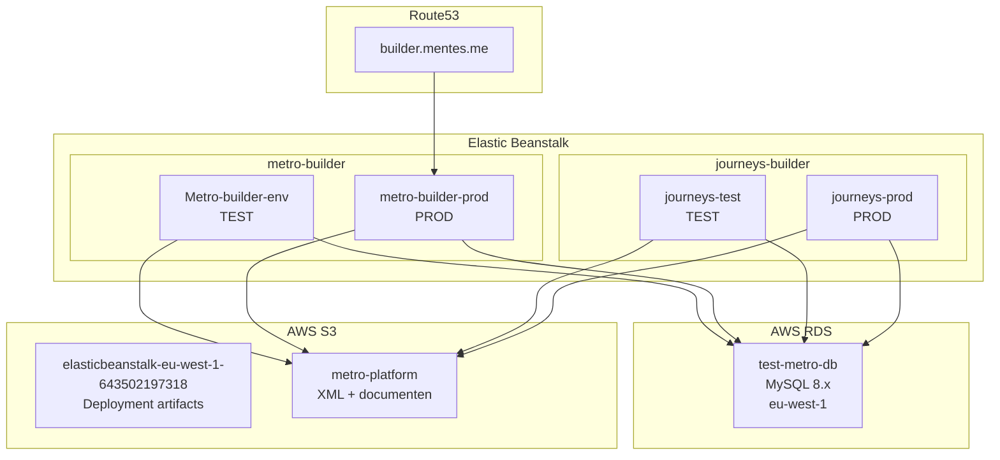
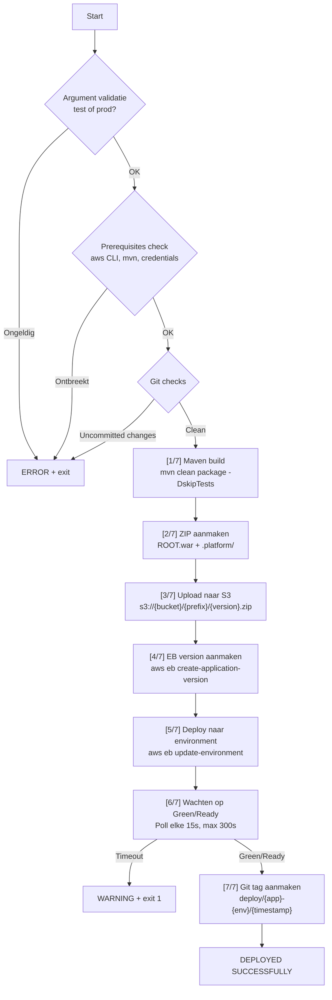

# Deployment & Infrastructuur

## AWS Omgevingen

| Omgeving | EB Application | EB Environment | Doel |
|----------|---------------|----------------|------|
| Assessment Test | metro-builder | Metro-builder-env | Assessment builder tegen test Metro DB |
| Assessment Prod | metro-builder | metro-builder-prod | Assessment builder tegen productie Metro DB |
| Journey Test | journeys-builder | journeys-test | Learning Journey builder tegen test Metro DB |
| Journey Prod | journeys-builder | journeys-prod | Learning Journey builder tegen productie Metro DB |

### Domein

- **builder.mentes.me** → `metro-builder-prod` (productie assessment builder)
- De andere omgevingen zijn bereikbaar via hun EB CNAME: `{env-name}.eba-dnykfhfz.eu-west-1.elasticbeanstalk.com`

## AWS Componenten



### AWS Account & Region

| Property | Waarde |
|----------|--------|
| Account ID | `643502197318` |
| Region | `eu-west-1` (Ireland) |
| S3 Deploy Bucket | `elasticbeanstalk-eu-west-1-643502197318` |
| S3 Content Bucket | `metro-platform` |
| RDS Host (test) | `test-metro-db.cyi4arp1bouk.eu-west-1.rds.amazonaws.com` |
| RDS Database | `metro` |

## Deploy Scripts

### `deploy-assessment.sh` — Assessment Builder

```bash
./deploy-assessment.sh test   # → Metro-builder-env
./deploy-assessment.sh prod   # → metro-builder-prod
```

### `deploy-journeys.sh` — Learning Journey Builder

```bash
./deploy-journeys.sh test     # → journeys-test
./deploy-journeys.sh prod     # → journeys-prod
```

### Deploy Flow (beide scripts)



### Stap-voor-stap details

1. **Argument validatie**: `test` of `prod`, met cross-check (voorkomt dat je assessment script voor journeys gebruikt)
2. **Prerequisites**: controleert `aws` CLI, `mvn`, en geldige AWS credentials (`aws sts get-caller-identity`)
3. **Git checks**:
   - Dirty check: weigert als er uncommitted changes zijn in tracked files
   - Pakt git commit hash (7 chars) voor version traceability
   - Waarschuwt als local ahead is van remote
4. **Maven build**: `mvn clean package -DskipTests -q` → `backend/target/ROOT.war` (~60MB)
5. **ZIP**: Bevat `ROOT.war` + `.platform/nginx/conf.d/timeout.conf`
6. **S3 upload**: Naar `{prefix}/{app}-{env}-{timestamp}-{git-hash}.zip`
7. **EB version**: `aws elasticbeanstalk create-application-version`
8. **Deploy**: `aws elasticbeanstalk update-environment`
9. **Health poll**: Elke 15 seconden, max 5 minuten. Succesvol als Status=Ready EN Health=Green.
10. **Git tag**: `deploy/{app}-{env}/{timestamp}` — gepusht naar origin

### Version Label Formaat

```
{app}-{env}-{YYYYMMDD}-{HHMMSS}-{git-hash}
```

Voorbeeld: `assessment-prod-20260225-160533-5354dd8`

### S3 Structuur

```
elasticbeanstalk-eu-west-1-643502197318/
├── builder/                          # Assessment Builder deploys
│   ├── assessment-test-20260225-160327-5354dd8.zip
│   └── assessment-prod-20260225-160533-5354dd8.zip
└── journeys/                         # Learning Journey deploys
    ├── journeys-test-20260218-142000-463d579.zip
    └── journeys-prod-20260219-090000-463d579.zip
```

## WAR Packaging

De backend wordt gebuild als WAR (niet JAR) voor Tomcat:

| Property | Waarde |
|----------|--------|
| Maven `packaging` | `war` |
| Maven `finalName` | `ROOT` |
| Output | `backend/target/ROOT.war` |
| Context path | `/` (door naam ROOT.war) |
| Grootte | ~60MB |

**Belangrijk**: Het bestand MOET `ROOT.war` heten. Als het `builder.war` heet, wordt de context path `/builder/` en werken alle frontend routes niet meer.

### .platform/nginx

Het bestand `backend/.platform/nginx/conf.d/timeout.conf` configureert Nginx als reverse proxy:

```nginx
proxy_connect_timeout 120;
proxy_send_timeout 120;
proxy_read_timeout 120;
client_max_body_size 15M;
```

Dit verhoogt de timeout van 60s naar 120s (nodig voor publish operaties) en staat bestandsuploads tot 15MB toe.

## Frontend in WAR

De Vite build output gaat naar `backend/src/main/webapp/`:

```bash
cd frontend && npm run build
# Output: ../backend/src/main/webapp/index.html + assets/
```

De `WebConfig.java` SPA fallback routeert alle niet-API en niet-statische requests naar `index.html`, zodat de frontend routing werkt.

## Git Tagging Strategie

Na elke deploy wordt automatisch een annotated tag aangemaakt:

```
deploy/assessment-test/20260225-160327
deploy/assessment-prod/20260225-160533
deploy/journeys-test/20260218-142000
```

Tags worden automatisch naar origin gepusht. Dit maakt het mogelijk om:
- Te traceren welke code op welke omgeving draait
- Terug te rollen naar een specifieke versie
- Deploy-historie te bekijken via `git tag -l 'deploy/*'`

## Downtime

Bij een EB deploy is er **korte downtime** (~30-60 seconden):
- Tomcat wordt herstart met de nieuwe WAR
- Bestaande JWT tokens blijven geldig (stateless, geen server-side sessie)
- Gebruikers die op dat moment ingelogd zijn moeten mogelijk even wachten of de pagina refreshen

Voor zero-downtime zou rolling deployment of blue-green nodig zijn.

## ECS Setup (in voorbereiding, niet actief)

Er is een Docker + ECS Fargate setup voorbereid maar nog niet in gebruik:

| Component | Status |
|-----------|--------|
| Dockerfile | Klaar (`backend/Dockerfile`) |
| ECR Repository | `journeys-builder` (aangemaakt) |
| ECS Task Definition | Template klaar, placeholders voor VPC/subnets |
| Deploy script | `infra/deploy-image.sh` (Docker build + push + ECS update) |
| Infra setup | `infra/deploy-ecs.sh` (12-staps provisioning) |

De ECS setup is bedoeld als toekomstige vervanging van EB, met voordelen als:
- Container-based (reproduceerbaar)
- Auto-scaling op CPU
- Betere health checks
- SSM Parameter Store voor secrets

**Bestanden**: `backend/Dockerfile`, `infra/deploy-ecs.sh`, `infra/deploy-image.sh`

## SSL/TLS

- **Browser → EB**: HTTPS via AWS-managed certificate
- **EB → RDS**: MySQL SSL vereist (`useSSL=true&requireSSL=true`)
- **RDS CA Bundle**: `certs/global-bundle.pem` (AWS RDS certificaatautoriteit)
