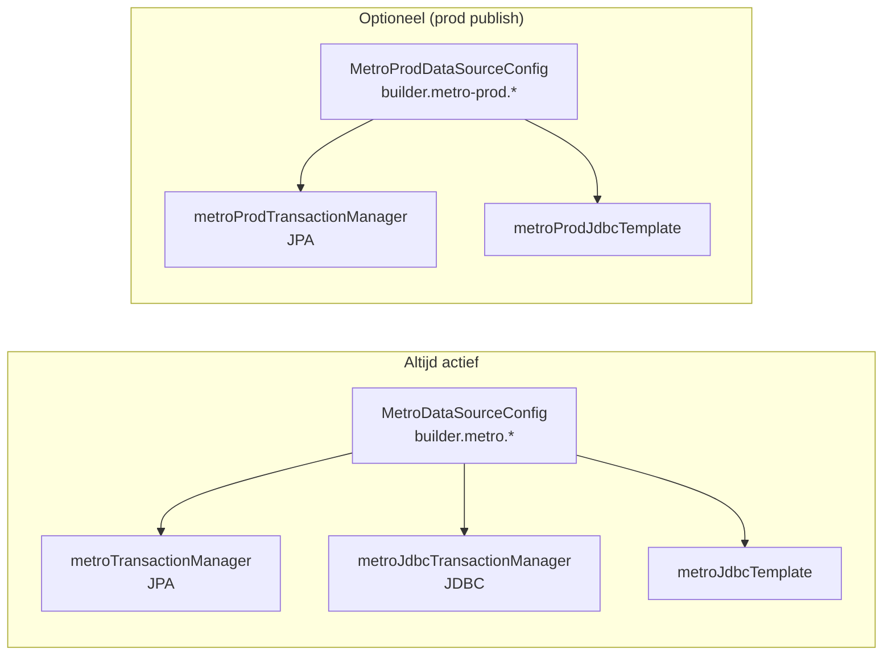

# Configuratie

## Environment Variables

Alle configuratie gaat via environment variables. Het bestand `backend/src/main/resources/application.yml` definieert de defaults.

### Metro Database (primair — test)

| Variable | Default | Vereist | Beschrijving |
|----------|---------|---------|-------------|
| `BUILDER_METRO_ENABLED` | `true` | Nee | Metro datasource aan/uit |
| `BUILDER_METRO_URL` | `jdbc:mysql://${DB_HOST}:3306/${DB_NAME}?useSSL=true&requireSSL=true` | Nee | Volledige JDBC URL (overschrijft DB_HOST/DB_NAME) |
| `DB_HOST` | `localhost` | Ja (prod) | MySQL hostname |
| `DB_NAME` | `metro` | Nee | Database naam |
| `DB_USERNAME` | `mastermetro` | Nee | Database gebruiker |
| `DB_PASSWORD` | _(leeg)_ | Ja (prod) | Database wachtwoord |
| `BUILDER_METRO_USERNAME` | `${DB_USERNAME}` | Nee | Override voor Metro-specifieke username |
| `BUILDER_METRO_PASSWORD` | `${DB_PASSWORD}` | Nee | Override voor Metro-specifieke password |

### Metro Database (productie — optioneel)

Wanneer `BUILDER_METRO_PROD_ENABLED=true` schrijft de builder publish-production endpoints naar een aparte database.

| Variable | Default | Vereist | Beschrijving |
|----------|---------|---------|-------------|
| `BUILDER_METRO_PROD_ENABLED` | `false` | Nee | Productie datasource aan/uit |
| `BUILDER_METRO_PROD_URL` | _(leeg)_ | Als enabled | JDBC URL naar productie Metro |
| `BUILDER_METRO_PROD_USERNAME` | _(leeg)_ | Als enabled | Productie DB username |
| `BUILDER_METRO_PROD_PASSWORD` | _(leeg)_ | Als enabled | Productie DB wachtwoord |

### Authenticatie

| Variable | Default | Vereist | Beschrijving |
|----------|---------|---------|-------------|
| `BUILDER_AUTH_ENABLED` | `true` | Nee | Authenticatie aan/uit (uit = dev mode) |
| `BUILDER_AUTH_USER` | `tester` | Nee | Legacy env-var login username (alleen als geen DB users) |
| `BUILDER_AUTH_PASSWORD` | _(leeg)_ | Ja (prod) | Wachtwoord voor admin seeding + legacy login |
| `BUILDER_AUTH_TOKEN_SECRET` | `changeme-in-production` | Ja (prod) | HMAC-SHA256 signing key voor JWT tokens |

**Belangrijk**: `BUILDER_AUTH_TOKEN_SECRET` MOET in productie overschreven worden. Het default `changeme-in-production` is onveilig.

### S3 Configuratie

| Variable | Default | Vereist | Beschrijving |
|----------|---------|---------|-------------|
| `BUILDER_S3_ENABLED` | `false` | Nee | S3 upload aan/uit |
| `BUILDER_S3_BUCKET` | `metro-platform` | Nee | S3 bucket naam |
| `BUILDER_S3_REGION` | `eu-west-1` | Nee | AWS region |
| `BUILDER_S3_PREFIX` | `test` | Nee | Pad prefix in bucket (bijv. `test` of `prod`) |

S3 credentials gaan via de AWS Default Credentials Provider (IAM role op EB, of `~/.aws/credentials` lokaal).

### Google Translate

| Variable | Default | Vereist | Beschrijving |
|----------|---------|---------|-------------|
| `GOOGLE_API_KEY` | _(leeg)_ | Nee | Google Cloud Translation API key |

Als niet geconfigureerd: vertaling valt terug op AI (OpenAI/Claude) met een warning.

### Spring Boot

| Variable | Default | Beschrijving |
|----------|---------|-------------|
| `SERVER_PORT` | `8080` | HTTP port |
| `spring.servlet.multipart.max-file-size` | `15MB` | Max upload grootte |
| `spring.jpa.open-in-view` | `false` | Geen lazy loading buiten transactie |
| `spring.jpa.hibernate.ddl-auto` | `none` | Geen automatische schema migratie |

## Spring Datasource Configuratie

De backend heeft een **dual datasource** setup:



- **MetroDataSourceConfig** (`builder.metro.enabled=true`): primaire datasource, wordt altijd gebruikt voor lookups en test publishes
- **MetroProdDataSourceConfig** (`builder.metro-prod.enabled=true`): optionele productie datasource, alleen voor publish-production endpoints

De publish controllers injecteren de juiste `JdbcTemplate` via `@Qualifier`:
- Test publish: `metroJdbcTemplate`
- Prod publish: `metroProdJdbcTemplate`

**Bestanden**: `backend/src/main/java/com/mentesme/builder/config/MetroDataSourceConfig.java`, `MetroProdDataSourceConfig.java`

## Lokaal Ontwikkelen

### Backend starten

Gebruik het start script of set handmatig de env vars:

```bash
cd backend

# Optie 1: via start script (gebruikt macOS Keychain voor wachtwoord)
./scripts/start-backend.sh

# Optie 2: handmatig
export DB_HOST=test-metro-db.cyi4arp1bouk.eu-west-1.rds.amazonaws.com
export DB_PASSWORD="<wachtwoord>"
export BUILDER_AUTH_PASSWORD="mentesme"
export BUILDER_AUTH_TOKEN_SECRET="dev-secret"
export BUILDER_S3_ENABLED=false
mvn spring-boot:run
```

De backend draait op port 8080.

### Frontend starten

```bash
cd frontend
npm install    # eerste keer
npm run dev    # Vite dev server op port 5173
```

De frontend `.env.local`:
```
VITE_API_BASE_URL=http://localhost:8080/api
```

De Vite dev server proxy't API calls naar de backend.

### Frontend builden (voor WAR)

```bash
cd frontend
npm run build
# Output gaat naar ../backend/src/main/webapp/
```

Na `npm run build` + `mvn clean package` bevat de WAR zowel de backend als frontend.

## Test Configuratie

Tests gebruiken een H2 in-memory database in MySQL compatibility mode:

```yaml
# backend/src/test/resources/application-test.yml
builder:
  metro:
    datasource:
      url: jdbc:h2:mem:metro;MODE=MYSQL;DB_CLOSE_DELAY=-1;DATABASE_TO_LOWER=TRUE
      username: sa
      password: ""
  auth:
    enabled: false
  s3:
    enabled: false
```

Tests draaien: `mvn test` (of `mvn clean package` zonder `-DskipTests`).

Er zijn 25 tests:
- 10 integratie tests (publish flows, lookups)
- 15 security smoke tests (auth, access flags, rol checks)

**Bestand**: `backend/src/test/resources/application-test.yml`

## EB Environment Variables (productie)

De EB environments hebben deze variabelen geconfigureerd:

```bash
# Bekijk huidige configuratie
aws elasticbeanstalk describe-configuration-settings \
  --application-name metro-builder \
  --environment-name metro-builder-prod \
  --region eu-west-1 \
  --query 'ConfigurationSettings[0].OptionSettings[?Namespace==`aws:elasticbeanstalk:application:environment`]'
```

Typische productie configuratie:

| Variable | Waarde |
|----------|--------|
| `DB_HOST` | `test-metro-db.cyi4arp1bouk.eu-west-1.rds.amazonaws.com` |
| `DB_PASSWORD` | _(geheim)_ |
| `BUILDER_AUTH_ENABLED` | `true` |
| `BUILDER_AUTH_PASSWORD` | `mentesme` |
| `BUILDER_AUTH_TOKEN_SECRET` | _(geheim)_ |
| `BUILDER_S3_ENABLED` | `true` |
| `BUILDER_S3_BUCKET` | `metro-platform` |
| `BUILDER_S3_PREFIX` | `test` of `prod` |
| `GOOGLE_API_KEY` | _(geheim)_ |

### EB configuratie wijzigen

```bash
aws elasticbeanstalk update-environment \
  --environment-name metro-builder-prod \
  --option-settings \
    "Namespace=aws:elasticbeanstalk:application:environment,OptionName=BUILDER_S3_PREFIX,Value=prod" \
  --region eu-west-1
```

## Nginx Configuratie

Elastic Beanstalk gebruikt Nginx als reverse proxy. Onze configuratie:

**Bestand**: `backend/.platform/nginx/conf.d/timeout.conf`

```nginx
proxy_connect_timeout 120;
proxy_send_timeout 120;
proxy_read_timeout 120;
client_max_body_size 15M;
```

Dit bestand wordt automatisch meegenomen in elke deployment ZIP.
